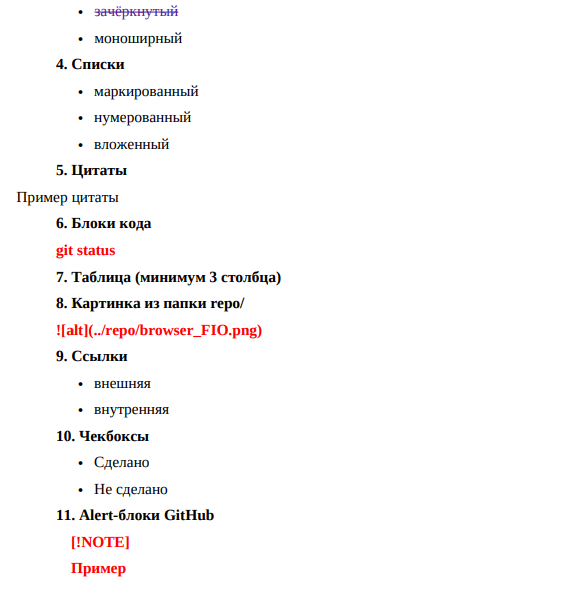

# Заголовок H1
## Заголовок H2
### Заголовок H3
#### Заголовок H4
##### Заголовок H5
###### Заголовок H6

***

## Горизонтальные линии
Выше линия из трех звездочек
---
А выше линия из трех дефисов

***

## Форматирование текста

**Жирный текст** или __тоже жирный__

*Курсивный текст* или _тоже курсивный_

***Жирный и курсивный*** или ___тоже жирный и курсивный___

~~Зачёркнутый текст~~

`Моноширинный текст (inline code)`

## Списки

### Маркированный список
* Пункт 1
+ Пункт 2
- Пункт 3
  * Вложенный пункт 3.1
  * Вложенный пункт 3.2
    + Еще один уровень вложенности

### Нумерованный список
1. Первый элемент
2. Второй элемент
3. Третий элемент
   1. Вложенный нумерованный 3.1
   2. Вложенный нумерованный 3.2
4. Четвертый элемент

### Смешанный вложенный список
1. Нумерованный пункт
   - Маркированный подпункт
   - Еще маркированный
     * Другой маркер
2. Второй нумерованный
   * Маркированный
   * Маркированный

## Цитаты

> Пример цитаты первого уровня
>> Вложенная цитата второго уровня
>>> Цитата третьего уровня
>
> Возврат к первому уровню цитаты

## Блоки кода

Однострочный код: `console.log("Hello")`

Многострочный блок кода:
```javascript
function hello() {
    console.log("Hello World!");
    return true;
}
```
## Таблица

| № | ФИО | Группа | Оценка |
|---|-----|--------|--------|
| 1 | Селиванов П.А. | ИСП-233 | 5 |
| 2 | Беляев В.А. | ИСП-233 | 5 |
| 3 | Иванов И.И. | ИСП-234 | 4 |

Таблица с выравниванием:
| Левый край | По центру | Правый край |
|:-----------|:---------:|------------:|
| Текст | Текст | 100 |
| Данные | Информация | 250 |

## Картинка



## Ссылки

Внешняя ссылка: [Google](https://www.google.com)

Внутренняя ссылка: [Перейти к таблице](#таблица)

## Чекбоксы

- [x] Сделано
- [ ] Не сделано
- [x] Задание 1 выполнено
- [ ] Задание 2 в процессе
- [ ] Задание 3 не начато

## Alert-блоки GitHub

> [!NOTE]
> Пример информационного сообщения
> Это важное примечание

> [!TIP]
> Полезный совет для работы

> [!WARNING]
> Предупреждение о возможных проблемах

> [!DANGER]
> Опасное или критическое действие

## Inline LaTeX

Формула: $a^2 + b^2 = c^2$

Уравнение: $E = mc^2$

Производная: $\frac{dy}{dx} = f'(x)$

## Block LaTeX

$$
\sum_{i=1}^n i = \frac{n(n+1)}{2}
$$

$$
\int_a^b f(x) \, dx = F(b) - F(a)
$$

$$
\begin{pmatrix}
a & b \\
c & d
\end{pmatrix}
$$